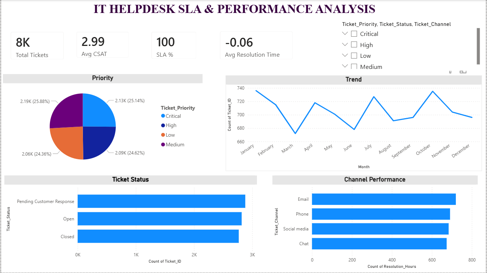

# IT Helpdesk Support Analysis

## Business Problem

IT support teams need to monitor ticket volume, resolution efficiency, and SLA compliance to improve service quality and customer satisfaction.

## Tools & Technologies

* MySQL (Data Storage & Querying)
* Power BI (Interactive Dashboard)
* Excel (Data Cleaning)

## Dataset Overview

The dataset includes:

* Ticket details (Type, Status, Priority)
* Customer attributes
* Response and resolution timestamps
* Customer Satisfaction Ratings

## Key Metrics (KPIs)

* **Total Tickets** – Overall workload
* **Average Resolution Time (Hours)** – Efficiency indicator
* **SLA Compliance (%)** – Tickets resolved within 24 hours
* **Customer Satisfaction (CSAT)** – Service quality measure

## Dashboard Highlights

* Monthly ticket trend analysis
* Ticket distribution by priority and status
* Channel-wise performance comparison
* SLA compliance tracking

## Key Insights

* High-priority tickets significantly impact SLA performance
* Certain channels show higher resolution delays
* Faster response times correlate with higher customer satisfaction

## Business Impact

* Helps identify operational bottlenecks
* Supports data-driven resource allocation
* Improves customer experience through SLA monitoring

## Dashboard Preview

## Author

MARADA DHARANIJA
